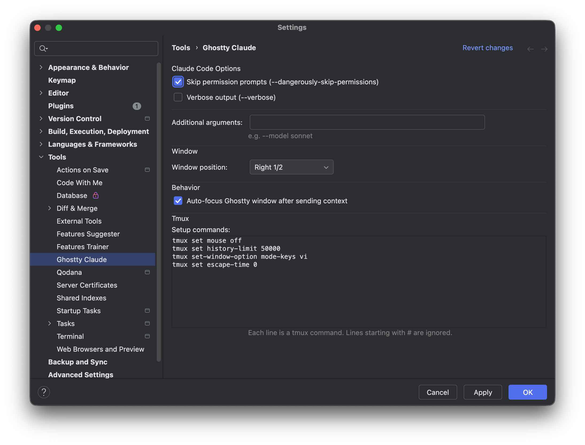

# Ghostty Claude

[](https://plugins.jetbrains.com/)
[](https://www.apple.com/macos/)
[](https://ghostty.org/)
[](https://docs.anthropic.com/en/docs/claude-code)
[](LICENSE)

[한국어](README_ko.md)

IntelliJ plugin that launches [Claude Code](https://docs.anthropic.com/en/docs/claude-code) in [Ghostty](https://ghostty.org/) terminal and sends file context from the editor with a single keyboard shortcut.


## Features

- **One shortcut** — `Cmd+Opt+K` (macOS) / `Ctrl+Alt+K` to launch or send context
- **Smart session management** — first press launches Ghostty + Claude Code, subsequent presses send file context to the existing session without opening a new window
- **Selection range** — sends `@file:line` for cursor position, `@file:start-end` for selected block
- **Worktree isolation** — each IntelliJ project window gets its own independent Ghostty + Claude Code session
- **Session recovery** — automatically re-attaches if the Ghostty window was closed but the tmux session is still alive
- **Configurable** — toggle `--dangerously-skip-permissions`, `--verbose`, or add custom CLI arguments from Settings

## How It Works

```
1st Cmd+Opt+K  →  Ghostty opens  →  Claude Code starts in project directory
2nd Cmd+Opt+K  →  @file:line sent to existing Claude Code session  →  Ghostty activates
```

The plugin creates a [tmux](https://github.com/tmux/tmux) session per project to reliably route file context to the correct Claude Code instance.

## Requirements

> **Platform**: macOS only. Ghostty and tmux path resolution is macOS-specific (`/Applications/Ghostty.app`, `/opt/homebrew/bin/tmux`). Linux support is not yet available.

| Dependency | Install |
|------------|---------|
| macOS | Required |
| [Ghostty](https://ghostty.org/) | Download from ghostty.org |
| [Claude Code](https://docs.anthropic.com/en/docs/claude-code) | `npm install -g @anthropic-ai/claude-code` |
| [tmux](https://github.com/tmux/tmux) | `brew install tmux` |
| IntelliJ IDEA | 2024.3 or later |

## Installation

### From JetBrains Marketplace (Coming Soon)

> Marketplace submission is under review. Once approved, you can install using the steps below.

1. IntelliJ IDEA → Settings → Plugins → Marketplace
2. Search for **"Ghostty Claude"**
3. Click **Install** → Restart

### From Disk

1. Download the latest zip from [Releases](https://github.com/lcalmsky/ghostty-claude-intellij/releases)
2. IntelliJ IDEA → Settings → Plugins → ⚙ → **Install Plugin from Disk**
3. Select the zip file and restart

### Build from Source

```bash
git clone https://github.com/lcalmsky/ghostty-claude-intellij.git
cd ghostty-claude-intellij
./gradlew buildPlugin
```

Output: `build/distributions/ghostty-claude-intellij-<version>.zip`

## Usage

### Launch Claude Code

1. Press `Cmd+Opt+K` from anywhere in IntelliJ (editor, project tree, terminal, etc.)
2. A Ghostty window opens with Claude Code running in the project directory

### Send File Context

1. Place your cursor on a line (or select a block of code) in the editor
2. Press `Cmd+Opt+K`
3. `@/path/to/File.kt:42` appears in Claude Code's input — type your question and press Enter

> When pressed outside the editor (e.g. project tree, tool windows), the shortcut opens or focuses the Ghostty window without sending file context.

### Multiple Projects

Each IntelliJ project window gets its own Ghostty session. When using git worktrees with separate IntelliJ windows, each window creates and communicates with its own independent Claude Code instance.

## Settings

**Settings → Tools → Ghostty Claude**



| Option | Description |
|--------|-------------|
| Skip permission prompts | Launches Claude Code with `--dangerously-skip-permissions` |
| Verbose output | Launches Claude Code with `--verbose` |
| Additional arguments | Custom CLI arguments (e.g. `--model sonnet`) |
| Window position | Controls where the Ghostty window appears (Left/Right half, thirds, etc.) |
| Auto-focus Ghostty | Automatically switch to Ghostty window after sending context |

> Note: Changing launch options only takes effect for new sessions. Close the existing Ghostty window and press the shortcut again to start a new session with updated options.

## Recommended Configuration

### tmux — Enable Mouse Scrolling

The plugin runs Claude Code inside a tmux session. By default tmux disables mouse scrolling, so add this to your `~/.tmux.conf`:

```bash
set -g mouse on
```

Apply to running sessions without restarting:

```bash
tmux set -g mouse on
```

### Ghostty — Window Sizing

The plugin reads your Ghostty config (`~/.config/ghostty/config`) to calculate window size accurately. The following settings are used:

```
font-family = JetBrainsMono Nerd Font Mono
font-size = 14
window-padding-x = 8
window-padding-y = 4
```

If you change your font or font size, the window sizing adjusts automatically — no plugin reconfiguration needed.

### IntelliJ — Ghostty Terminal Compatibility

When launching IntelliJ from a Ghostty terminal via `idea .`, IntelliJ may show errors due to the `TERM=xterm-ghostty` environment variable. Add this alias to your `~/.zshrc`:

```bash
alias idea='TERM=xterm-256color idea'
```

This overrides the TERM variable only for IntelliJ while preserving Ghostty's terminal features for normal shell usage.

## License

MIT — see [LICENSE](LICENSE) for details.
